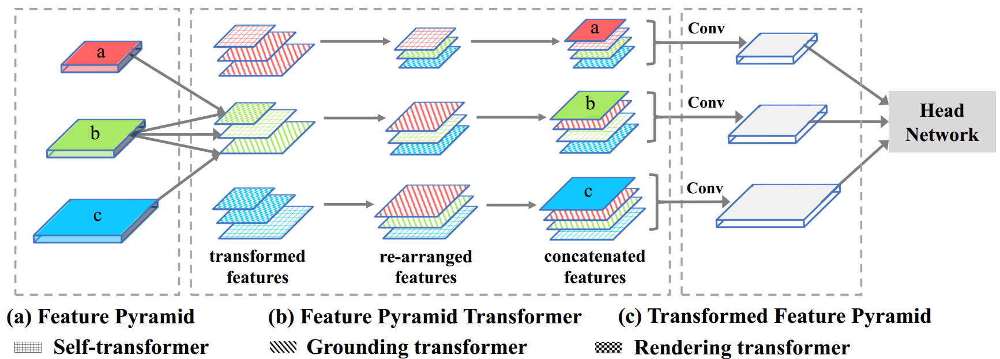

# Feature Pyramid Transformer

[](https://arxiv.org/abs/2007.09451)
[](LICENSE)
[](https://pytorch.org)

Official implementation of the paper: **Feature Pyramid Transformer** (ECCV 2020). This work introduces a novel approach for active feature interactions across both space and scales, transforming feature pyramids into richer contextual representations.

## 📖 Overview

Feature interactions across space and scales are fundamental to modern visual recognition systems as they introduce beneficial visual contexts. While conventional methods rely on passive context accumulation through increasing receptive fields or active encoding via non-local convolrations, they often fail to capture non-local contexts across different scales.

**Feature Pyramid Transformer (FPT)** addresses this limitation by enabling fully active feature interactions across both space and scales. It transforms any feature pyramid into another of the same size but with richer contexts, using three specially designed transformers in self-level, top-down, and bottom-up interaction fashion.

<div align="center">

<p> Overall architecture of Feature Pyramid Transformer (FPT). Different texture patterns indicate different feature transformers, and different colors represent feature maps at different scales. "Conv" denotes a 3×3 convolution with output dimension of 256.</p>
</div>

### Key Features
- **Cross-scale interactions**: Active feature exchange across different pyramid levels
- **Three interaction modes**: Self-level, top-down, and bottom-up transformers
- **Generic backbone**: Plug-and-play module with fair computational overhead
- **Consistent improvements**: Demonstrated across instance-level and pixel-level tasks

## Installation

### Requirements

- **Python**: 3.6+
- **PyTorch**: 1.4+
- **CUDA**: 8.0+ (8 GPUs recommended)

### Package Installation

```bash
# Create conda environment (recommended)
conda create -n fpt python=3.7
conda activate fpt

# Install PyTorch (adjust according to your CUDA version)
conda install pytorch=1.4 torchvision cudatoolkit=10.1 -c pytorch

# Install required packages
pip install cython matplotlib numpy scipy opencv-python pyyaml packaging tensorboardX

# Install pycocotools
pip install git+https://github.com/cocodataset/cocoapi.git#"subdirectory=PythonAPI"

# Install DropBlock (if needed)
pip install dropblock
```

## 📊 Data Preparation

### COCO Dataset

1. **Download COCO dataset** from [official website](http://cocodataset.org/#download):
   - 2017 Train/Val images
   - 2017 Train/Val annotations

2. **Organize the directory structure**:
   ```
   coco/
   ├── annotations/
   │   ├── instances_train2017.json
   │   ├── instances_val2017.json
   │   └── ...
   └── images/
       ├── train2017/
       │   ├── 000000000009.jpg
       │   └── ...
       └── val2017/
           ├── 000000000139.jpg
           └── ...
   ```

3. **Create soft link in the repository**:
   ```bash
   cd {repo_root}
   mkdir -p data
   ln -s /path/to/your/coco data/coco
   ```

> **Tip**: Place images on SSD for better training performance.

## Pretrained Models

### Caffe Pretrained Models (Recommended)

| Model | Download Link |
|-------|---------------|
| ResNet50 | [Download](https://drive.google.com/open?id=1wHSvusQ1CiEMc5Nx5R8adqoHQjIDWXl1) |
| ResNet101 | [Download](https://drive.google.com/open?id=1x2fTMqLrn63EMW0VuK4GEa2eQKzvJ_7l) |
| ResNet152 | [Download](https://drive.google.com/open?id=1NSCycOb7pU0KzluH326zmyMFUU55JslF) |

### Detectron Pretrained Models

| Model | Download Link |
|-------|---------------|
| R-50.pkl | [Download](https://s3-us-west-2.amazonaws.com/detectron/ImageNetPretrained/MSRA/R-50.pkl) |
| R-101.pkl | [Download](https://s3-us-west-2.amazonaws.com/detectron/ImageNetPretrained/MSRA/R-101.pkl) |
| R-50-GN.pkl | [Download](https://s3-us-west-2.amazonaws.com/detectron/ImageNetPretrained/47261647/R-50-GN.pkl) |
| X-101-32x8d.pkl | [Download](https://s3-us-west-2.amazonaws.com/detectron/ImageNetPretrained/20171220/X-101-32x8d.pkl) |

**Download pretrained models** and place them in `{repo_root}/data/pretrained_model/`.

> **Note**: Caffe pretrained weights generally provide slightly better performance than PyTorch pretrained weights.

## Quick Start

### Training

#### 1. Train from Scratch
```bash
python tools/train_net_step.py \
    --dataset coco2017 \
    --cfg configs/e2e_fptnet_R-50_mask.yaml \
    --use_tfboard \
    --bs 8 \        # Adjust based on your GPU memory
    --nw 4          # Number of data loader workers
```

#### 2. Fine-tune from Checkpoint
```bash
python tools/train_net_step.py \
    --dataset coco2017 \
    --cfg configs/e2e_fptnet_R-50_mask.yaml \
    --load_ckpt path/to/checkpoint.pth
```

#### 3. Resume Training
```bash
python tools/train_net_step.py \
    --dataset coco2017 \
    --cfg configs/e2e_fptnet_R-50_mask.yaml \
    --load_ckpt path/to/checkpoint.pth \
    --resume
```

### Command Line Options

| Option | Description |
|--------|-------------|
| `--bs` | Batch size (adjust according to GPU memory) |
| `--nw` | Number of data loader workers (default: 4) |
| `--use_tfboard` | Enable TensorBoard logging |
| `--load_ckpt` | Load model from checkpoint |
| `--load_detectron` | Load Detectron-style checkpoint |
| `--resume` | Resume training with optimizer state |
| `--no_save` | Disable checkpoint saving (for debugging) |
| `--set` | Override config options |

### Configuration Examples

```bash
# For debugging (faster iterations)
python tools/train_net_step.py \
    --dataset coco2017 \
    --cfg configs/e2e_fptnet_R-50_mask.yaml \
    --no_save \
    --set DEBUG True

# Custom configuration
python tools/train_net_step.py \
    --dataset coco2017 \
    --cfg configs/e2e_fptnet_R-50_mask.yaml \
    --set SOLVER.BASE_LR 0.0025 SOLVER.MAX_ITER 180000
```

## Evaluation & Inference

### Model Evaluation
```bash
python tools/test_net.py \
    --dataset coco2017 \
    --cfg configs/e2e_fptnet_R-50_mask.yaml \
    --load_ckpt path/to/checkpoint.pth
```

### Results Visualization
```bash
python tools/infer_simple.py \
    --dataset coco \
    --cfg configs/e2e_fptnet_R-50_mask.yaml \
    --load_ckpt path/to/checkpoint.pth \
    --image_dir path/to/input/images \
    --output_dir path/to/save/visualizations
```

## 🏗️ Project Structure

```
FeaturePyramidTransformer/
├── configs/                 # Configuration files
├── tools/                   # Training and evaluation scripts
├── lib/                     # Core implementation
│   ├── modeling/           # Model definitions
│   ├── utils/              # Utility functions
│   └── dataloaders/        # Data loading modules
├── data/                   # Data and pretrained models
├── demos/                  # Demo images and visualizations
└── outputs/                # Training outputs and checkpoints
```

## 🎯 Supported Tasks & Backbones

### Tasks
- ✅ Object Detection
- ✅ Instance Segmentation  
- ✅ Semantic Segmentation

### Backbones
- ✅ ResNet-50/101/152
- ✅ ResNeXt-101-32x8d/64x4d
- ✅ Group Normalization variants

## Technical Details

### Custom DataParallel
This implementation includes an enhanced `nn.DataParallel` with:
- **CPU keyword inputs**: Keeps certain inputs on CPU to save GPU memory
- **Variable blob sizes**: Allows different image sizes per GPU
- **Dictionary returns**: Compatible with dictionary-type outputs

### Performance Tips
- Use **SSD storage** for training data
- Adjust `--bs` based on your GPU memory
- Enable `--use_tfboard` for better training monitoring
- Use Caffe pretrained models for best performance

## Citation

If you use this code in your research, please cite our paper:

```bibtex
@inproceedings{zhang2020fpt,
  title={Feature Pyramid Transformer},
  author={Zhang, Dong and Zhang, Hanwang and Tang, Jinhui and Wang, Meng and Hua, Xiansheng and Sun, Qianru},
  booktitle={European Conference on Computer Vision (ECCV)},
  year={2020}
}
```

## Contributing

We welcome contributions! Please feel free to submit issues and pull requests.

## Contact

For questions and discussions about this implementation, please open an issue on GitHub.

---

<div align="center">

## ✨ **Maintained by**

**Saad Abdur Razzaq**  
*Machine Learning Engineer | Effixly AI*

[](https://saadarazzaq.dev)
[](https://www.linkedin.com/in/saadarazzaq)
[](mailto:sabdurrazzaq124@gmail.com)
[](https://github.com/saadabdurrazzaq)

---

### ⭐ **Don't forget to star this repository if you find it helpful!**

</div>
